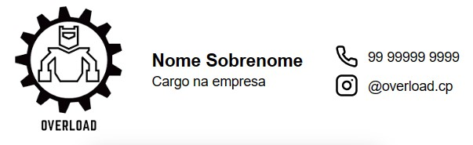

# 📧 Gerador de assinaturas - Overload

Este projeto é um fork do [Gerador de Assinaturas da Solucaut](https://github.com/Solucaut/Gerador-de-assinaturas)

## TLDR;
- [Como criar sua assinatura e adicionar no Gmail](https://github.com/Diego-Lopes-Ferreira/Email-sign-generator/wiki/Gerando-uma-assinatura)
- [Criando a sua própria versão da ferramenta](https://github.com/Diego-Lopes-Ferreira/Email-sign-generator/wiki/Criando-a-sua-pr%C3%B3pria-vers%C3%A3o)

## Tecnologias utilizadas 💻
Desde o início a ideia foi manter o projeto o mais simples possível, por esse motivo, nenhuma biblioteca ou Framework foram utilizados.
* Javascript
* HTML
* CSS

## Utilizando a ferramenta 🔌
* Se você **é um membro** do Overload, é só acessar [essa página](https://ximiraxelo.github.io/assinatura-email-overload/) e inserir suas informações para criar a assinatura. As instruções para adicionar ao Gmail você encontra [aqui](https://github.com/Diego-Lopes-Ferreira/Email-sign-generator/wiki/Gerando-uma-assinatura) .
* Caso você **não** seja um membro, você pode encontrar instruções para criar sua própria versão [aqui](https://github.com/Diego-Lopes-Ferreira/Email-sign-generator/wiki/Criando-a-sua-pr%C3%B3pria-vers%C3%A3o).

 ## Contribuindo 🔎
 Se você deseja contribuir de alguma maneira, fique a vontade. Aqui vão algumas sugestões:
 * Melhorando a documentação
	 * Aumentando a wiki
	 * Colocando comentários nos códigos
 * Otimizando o código
 * Deixando o site mais responsivo
 * Consertando ou reportando bugs
 * Dando sugestões de novas features ou melhorias
 
 ## Licença 📕
 Esse projeto está sob a [licença MIT](https://www.mit.edu/~amini/LICENSE.md), o que quer dizer que você pode fazer sua própria versão e inclusive distribuir comercialmente, então fique a vontade para criar seu fork.
 
 ## Contribuidores 🗿
|  |  |  | 
|--|--|--|--|
| [@Diego-Lopes-Ferreira](https://github.com/Diego-Lopes-Ferreira) | [@Tashima42](https://github.com/tashima42) | [@Guilherme-Schimidt](https://github.com/Guilherme-Schmidt) | [@ximiraxelo](https://github.com/ximiraxelo)
